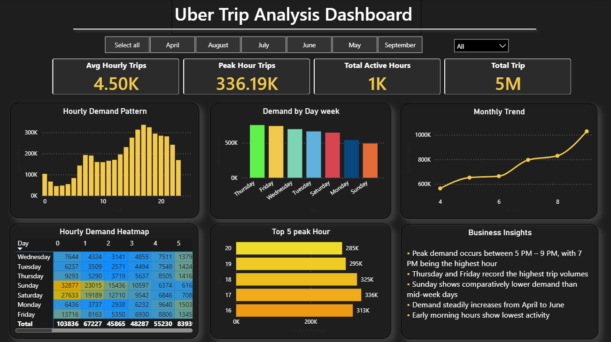
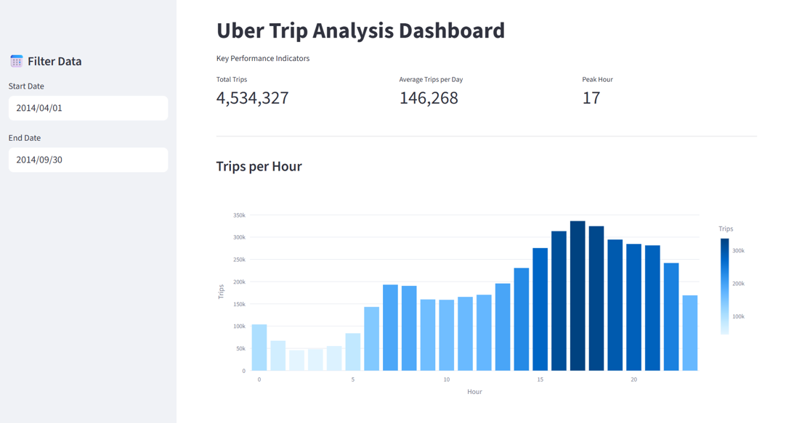

# 🚖 Uber Trip Analysis – Advanced Data Analytics Project

### 📌 Project Overview

This project performs an end-to-end advanced data analytics analysis on Uber trip data (April–September 2014).

The objective is to analyze demand patterns, detect seasonality, identify peak hours, perform SQL-based analytics, and build a predictive model for hourly trip forecasting.

This project demonstrates strong capabilities in:

- SQL Analytics (DuckDB)

- Data Cleaning & Feature Engineering

- Exploratory Data Analysis (EDA)

- Time Series Analysis

- Predictive Modeling

- Interactive Dashboard Development (Streamlit)

### 🎯 Business Objectives

- Identify peak demand hours and days

- Analyze monthly growth trends

- Detect seasonal patterns

- Evaluate base-level performance

- Forecast hourly trip demand

- Provide actionable business recommendations

### 🛠 Tools & Technologies

| Category         | Tools Used                  |
| ---------------- | --------------------------- |
| Programming      | Python                      |
| SQL Engine       | DuckDB                      |
| Data Processing  | Pandas, NumPy               |
| Visualization    | Matplotlib, Seaborn, Plotly |
| Time Series      | Statsmodels                 |
| Machine Learning | Scikit-learn                |
| BI Dashboard     | Power BI                    |
| Web Dashboard    | Streamlit                   |
| Environment      | Jupyter Notebook, VS Code   |

### 📊 Dataset Information

Dataset: Uber TLC FOIL Response Dataset (2014)

Download Link: https://drive.google.com/drive/folders/18NQlkW0fl3rEkj8M5uZ_W7Kbg5axecIN?usp=sharing

Contains:

- Date/Time

- Latitude

- Longitude

- Base

Covers April to September 2014 with over 4.5 million trip records.

### 🔎 Project Workflow

#### 1️⃣ Data Cleaning

- Merged multiple monthly CSV files

- Converted Date/Time to datetime format

- Checked for missing values and duplicates

- Created time-based features:

     - Hour

     - Day

     - Month

     - DayOfWeek

     - Lag_1

     - Lag_24

#### 2️⃣ SQL Analytics (DuckDB)

Performed aggregation queries:

- Total trips

- Trips per hour

- Trips per day of week

- Monthly growth trend

- Base performance

- Daily trip trend

#### 3️⃣ Exploratory Data Analysis

Created visualizations:

- Trips per Hour

- Trips per Day

- Monthly Trend

- Hour vs Day Heatmap

- Hourly Time Series

- 24-Hour Rolling Average

- Pickup Location Map

#### 4️⃣ Time Series Analysis

- Converted trips into hourly time series

- Applied seasonal decomposition

- Identified:

     - Trend component

     - Daily seasonality

     - Residual variation

#### 5️⃣ Predictive Modeling

Model Used:

- Random Forest Regressor

Evaluation Metrics:

- Mean Absolute Error (MAE)

- R² Score

Lag features significantly improved model accuracy.

### 📈 Key Insights

- Peak demand occurs between 5 PM – 9 PM

- Weekend trips are higher than weekdays

- Strong daily seasonality detected

- Trip volume increased from April to September

- Manhattan region shows highest pickup concentration

- Lag features improve forecasting performance

### 💼 Business Recommendations

- Increase driver allocation during peak evening hours

- Implement surge pricing during predictable high-demand periods

- Optimize fleet distribution based on demand heatmaps

- Use forecasting model for driver scheduling optimization

 ### 📊 Power BI Dashboard

An interactive Power BI dashboard was developed to visualize Uber trip demand patterns, including peak hours, weekday trends, and monthly growth.

The dashboard provides key insights through KPI metrics, hourly demand analysis, heatmaps, and trend visualizations.

#### Dashboard Preview

#### Key Dashboard Features

- KPI Cards for Total Trips, Average Trips, and Peak Demand

- Hourly Demand Analysis to identify peak travel times

- Day-of-Week Comparison to analyze weekday vs weekend activity

- Monthly Trend Analysis to detect seasonal patterns

- Demand Heatmap (Hour vs Day) to highlight high-demand periods

- Interactive Filters for Month and DayOfWeek selection

- Business Insights Panel summarizing key findings

#### Tools Used

Power BI

DAX

Data Modeling

Data Visualization

### 📊 Streamlit Dashboard

Interactive dashboard includes:

- KPI metrics

- Hourly demand chart

- Daily demand chart

- Monthly trend

- Rolling average

- Heatmap visualization

- Base performance

- Interactive pickup location map

### 🚀 How to Run the Project

1. Clone repository

2. Install requirements:

pip install -r requirements.txt

3. Run Jupyter Notebook for analysis

4. Launch dashboard:

streamlit run dashboard/Streamlit.py

### 🧠 Skills Demonstrated

- SQL Querying & Aggregation

- Data Wrangling

- Advanced Visualization

- Time Series Analysis

- Feature Engineering

- Predictive Modeling

- Business Insight Communication

- Dashboard Development

### 🏆 Conclusion

This project demonstrates strong end-to-end data analytics capabilities, combining SQL analytics, time series analysis, predictive modeling, and dashboard development to generate actionable business insights.

